# PLOT 09/2023

Programming Languages of Tomorrow

<!-- _paginate: false -->
<!-- _footer: "" -->
<!-- style: "
img[alt~='center'] {
  display: block;
  margin: 0 auto;
}
" -->

---

## Purpose of These Slides

The world of programming is evolving every year. It is enriched with new languages, new libraries, new technologies that make yesterday's used look old.

These slides aim to be an overview of what the world of programming is today and what the world of programming will be tomorrow, starting from the point of view of languages and the perspectives they can give us in the world of work.

---

## TIOBE index

The TIOBE Programming Community index is an indicator of the popularity of programming languages. The index is updated once a month. The ratings are based on the number of skilled engineers worldwide, courses and third-party vendors. Popular search engines such as Google, Bing, Yahoo!, Wikipedia, Amazon, YouTube and Baidu are used to calculate the ratings. It is important to note that the TIOBE index is not about the best programming language or the language in which most lines of code have been written.

---

## TIOBE index - 2023

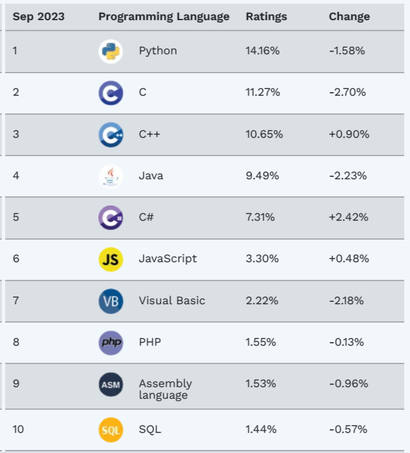

---

## Is TIOBE a starting point or an end point?

Does TIOBE's popularity of a language truly give a real index of how much a language is paid?
Let's try to add other information from job search portals to these data.

---

## Remoteok

RemoteOK is a portal for searching remote jobs: let's look at its stats.

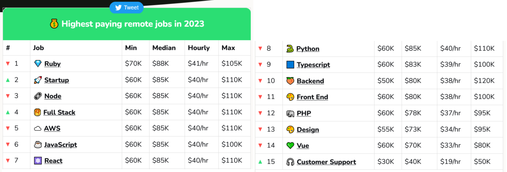

<https://remoteok.com/remote-work-statistics>

---

## Remoteok - conclusion?

Ruby appears to be the highest paid language and PHP the lowest paid, but let's not be distracted by these data: the difference is only 10%.
Why is the difference so low? Maybe because job postings are now tending to include many cross-functional skills?

---

## PYPL PopularitY of Programming Language

The PYPL PopularitY of Programming Language Index is created by analyzing how often language tutorials are searched on Google: the more a language tutorial is searched, the more popular the language is assumed to be. It is a leading indicator. The raw data comes from Google Trends.

<https://pypl.github.io/PYPL.html>

---

## PYPL Topten

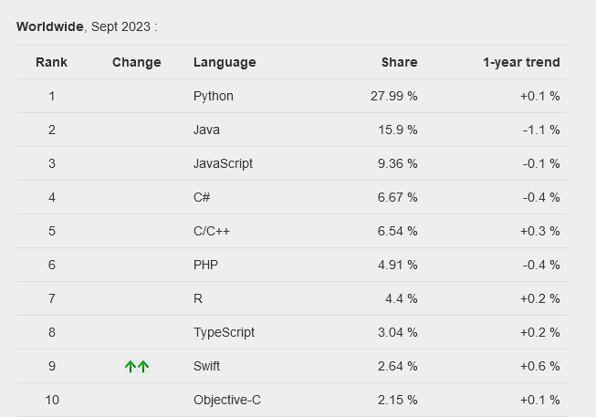

---

## Stack Overflow survey

The Stack Overflow survey is an annual survey conducted by Stack Overflow, one of the largest online communities for developers. It aims to gather insights into the coding community, including their preferences, experiences, and opinions on various aspects of their work and career.

The survey covers a wide range of topics, including programming languages, frameworks, tools, job satisfaction, salary, education, and demographics. It provides valuable data that can help developers understand industry trends, make informed career decisions, and allow companies to gain insights into the needs and interests of developers.

<https://survey.stackoverflow.co/2023>

---

## Stack Overflow - Best Language

What is the highest-paid programming language according to Stack Overflow?

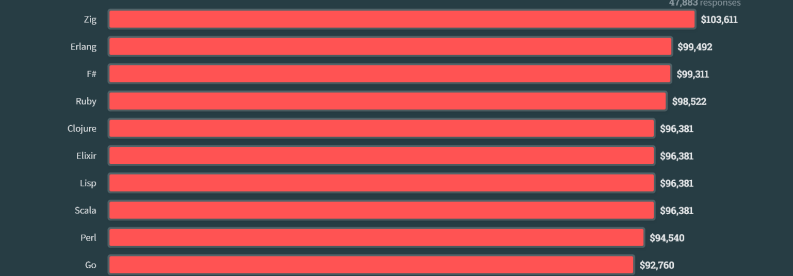

---

## Stack Overflow - Worst Language

What is the least paid programming language according to Stack Overflow?

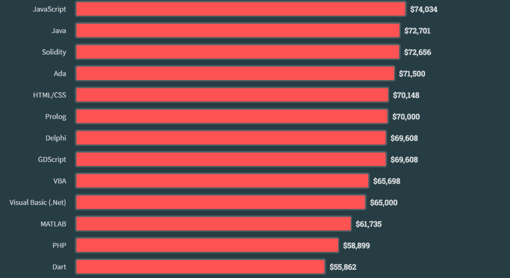

---

## Stack Overflow - Best Job

What is the highest paying job according to Stack Overflow?

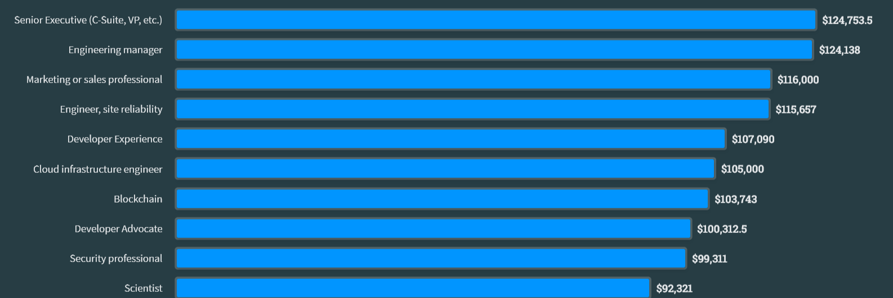

---

## Stack - Lowest Job

What is the lowest paid job according to Stack Overflow?

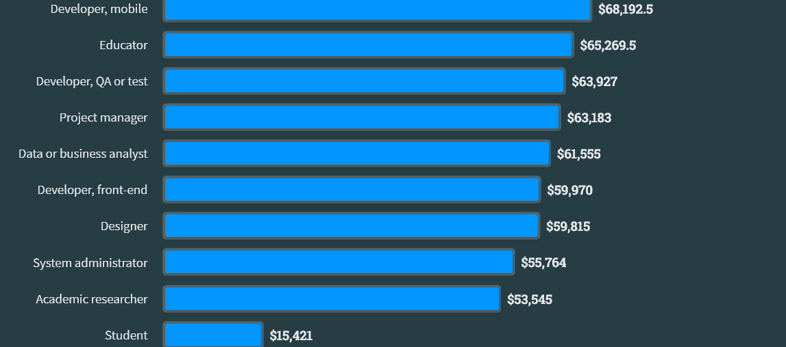

---

## Stack - IDE

What is the best IDE according to Stack Overflow?

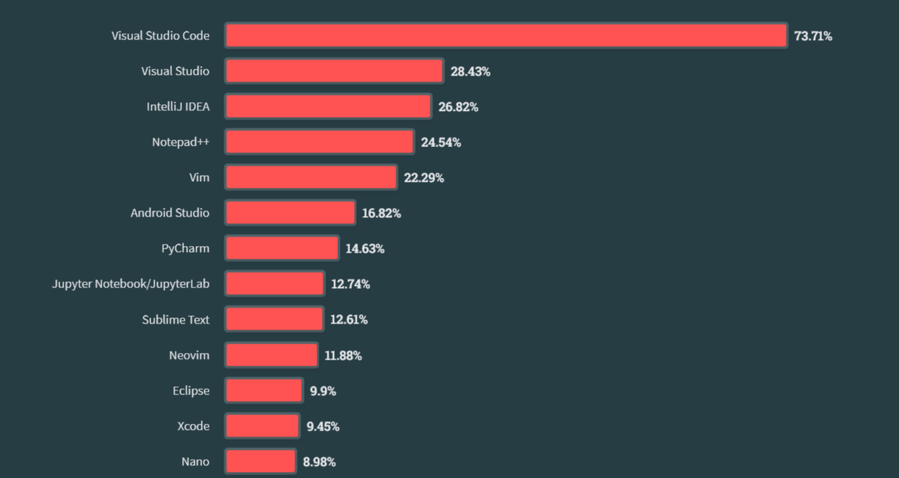

---

## Stack - Language to learn

What language should we learn according to Stack Overflow?

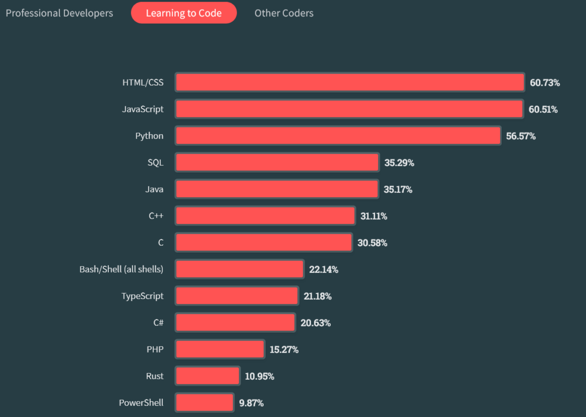

---

## Stack - Technology to learn

What technology should we learn according to Stack Overflow?

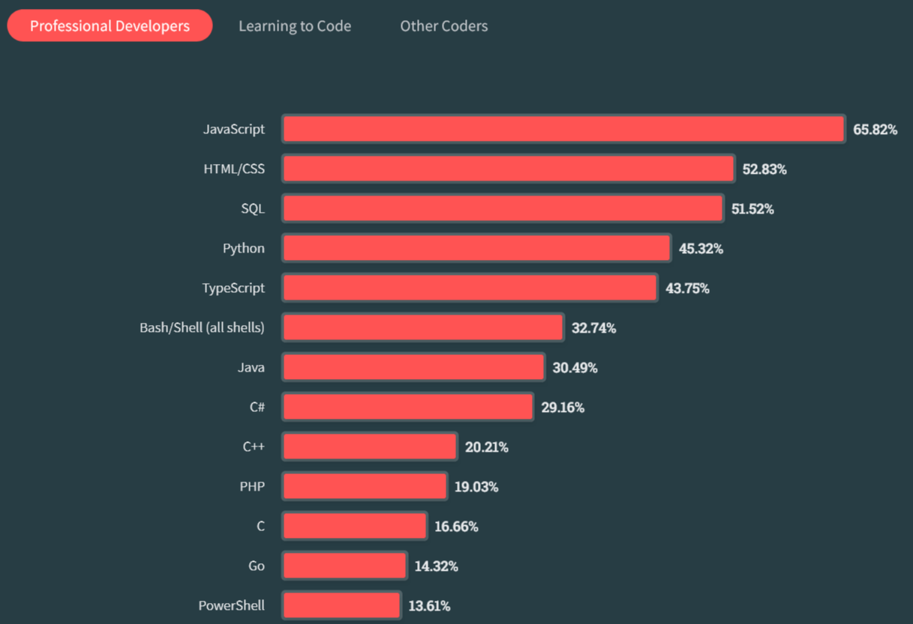

---

## Stack - Web Technology to learn

What web technology should we learn according to Stack Overflow?

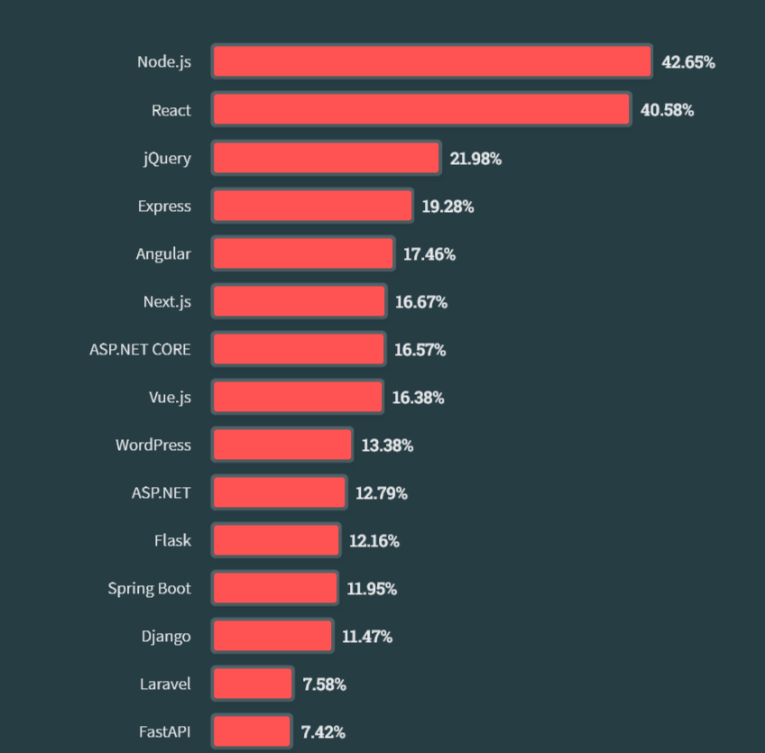

---

## What have we understood?

* The most popular languages are not necessarily the most paid
* In 2023, Many of us still need to learn HTML and CSS.

---

## Italian developer salary

<https://it.talent.com/it/salary?job=developer>

---

## German developer salary

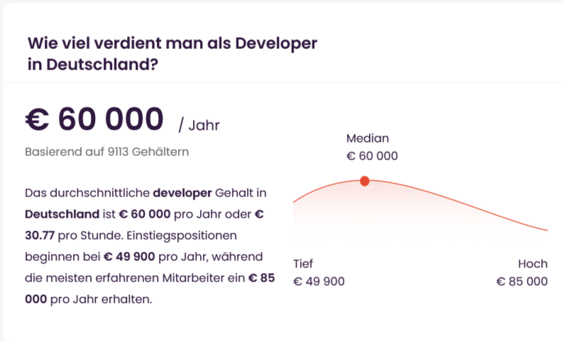

<https://de.talent.com/it/salary?job=developer>

---

## Swiss Developer Salary

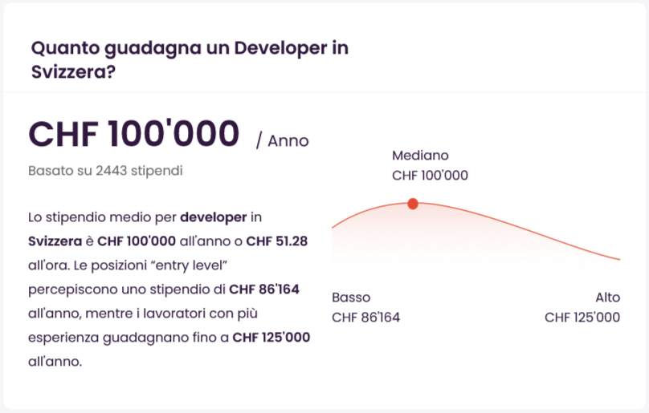

<https://ch.talent.com/it/salary?job=developer>

---

## Now, what should I learn in 2024?

Any language: the market is so big that the opportunities are many.

## Once I have learned a language, am I done?

It used to be enough, now it is just the first step to becoming a programmer.

## What do I need to learn besides the language?

Definitely one framework or more than one framework.

---

## Disclaimer

The author partially generated this text with GPT-3, OpenAI's large-scale language generation model and Google Bard.
After generating the language draft, the author reviewed, modified and revised the language to their liking and assumes ultimate responsibility for the content of this publication.

The background image was generated with <https://app.haikei.app>

---

## Licenze

These slides are released under an Apache 2 license. You can use, modify and distribute these slides provided you give me credit as the original author and that you do not use them for commercial purposes.
